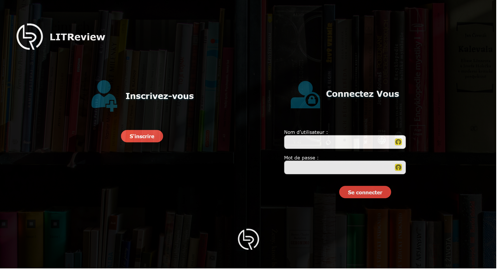

# LITRevu


[](https://www.python.org/dev/peps/pep-0008/)
[](https://flake8.pycqa.org/en/latest/)
[](https://github.com/psf/black)
[](https://(https://github.com/rtts/djhtml))


Son objectif est de commercialiser un produit permettant à une communauté d'utilisateurs de publier des critiques de livres ou d’articles et de consulter ou de solliciter une critique de livres à la demande.

L'application permet de demander ou publier des critiques de livres ou d’articles. L’application présente trois cas d’utilisation principaux :

1. la publication des critiques de livres ou d’articles ;
2. la demande des critiques sur un livre ou sur un article particulier ;
3. la recherche d’articles et de livres intéressants à lire, en se basant sur les critiques des autres.

Vous pouvez vous référer aux documents du projet dans le dossier docs

* __[Dossier docs](docs/)__
* __[Consulter le cahier des charges](docs/Cahier_des_charges.pdf)__


## Installation et activation de l'environnement Virtuel
Ouvrez un nouveau terminal et taper : 
```bash
python -m venv .env-projet9-litrevu
```
Selectionner l'environnement virtuel dans visual studio code ou l'activer en se plaçant dans le dossier **.env-litrevu/scripts** et taper : 
```bash
./activate
```
Installer les dependances necessaires au projet : 
```bash
pip install -r requirements.txt
```

## Usage

* Le projet est fourni avec une base de données exemple avec 3 utilisateurs :
    * __name :__ user1 __password :__ litrevu1
    * __name :__ user2 __password :__ litrevu2
    * __name :__ user3 __password :__ litrevu3
* Un super utilsateur : 
    * __name :__ superuser1 __password :__ superuser1


pour la tester lancer simplement le serveur de developpement en se placant dans le dossier du projet `litrevu`


Exécutez la commande suivante pour lancer le serveur de développement :

```bash
python manage.py runserver
```

Si vous voulez partir de zéro, effacer le fichier de la base `db.sqlite3` dans le dossier du projet et créer une base vierge en applicant les migrations :

```bash
python manage.py migrate
```
Créer un super utilisateur pour utiliser l'interface d'administartion :

```bash
python manage.py createsuperuser
```

Puis lancer le serveur

```bash
python manage.py runserver
```


le serveur de développement démarre à l'adresse http://127.0.0.1:8000/ et vous arrivez sur la page de connexion



Vous pouvez consulter le cahier des charges pour le détail des fonctionnalités :

* __[Consulter le cahier des charges](docs/Cahier_des_charges.pdf)__
 
---
## Vérification du Code : 

* Le code a été formaté avec `black` pour le python, `djhtml` pour le django html et `css formatter` pour le css 
et il respecte les recommandations pep8.

* Utilisation de `isort` pour l'organisation des imports et de `pycln` pour le pep8.

---
#### Procédure pour générer un rapport flake8 en HTML


Dans le terminal dans le dossier du projet , tapez la commande suivante pour afficher la politique d'exécution actuelle :
```
flake8 --format=html --htmldir=rapports_flake8 --exclude=.env-projet9-litrevu
```
Le rapport sera sauvegardé dans le dossier rapports_flake8, il suffira de lancer le fichier index.html

## Contribuer

Si vous souhaitez contribuer à ce projet, veuillez suivre ces étapes :

    Ouvrez un problème pour discuter de ce que vous souhaitez changer.
    Fork ce dépôt et créez une branche pour votre contribution.
    Soumettez une demande d'extraction avec vos modifications.


